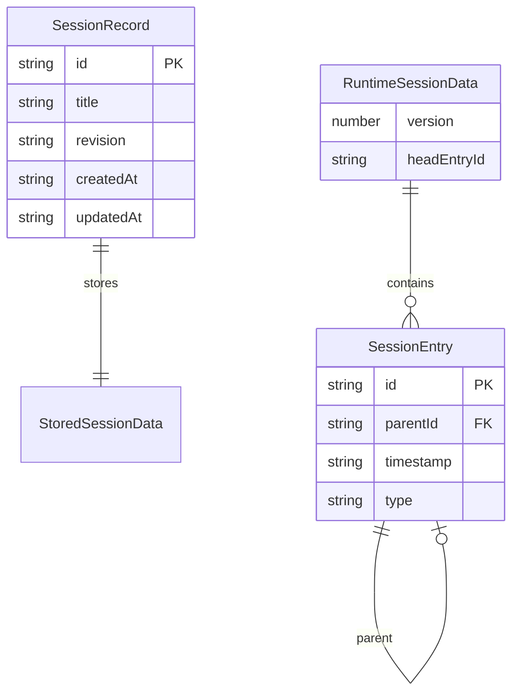
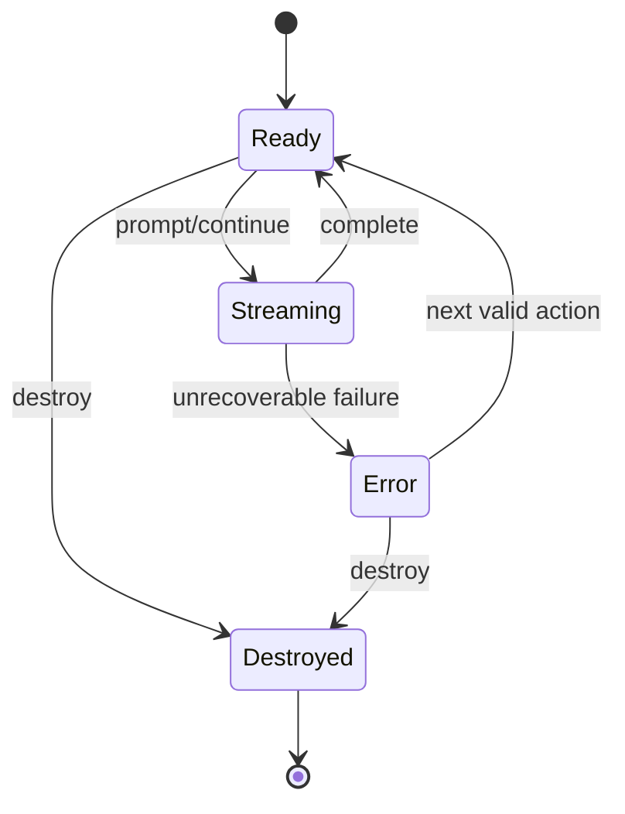
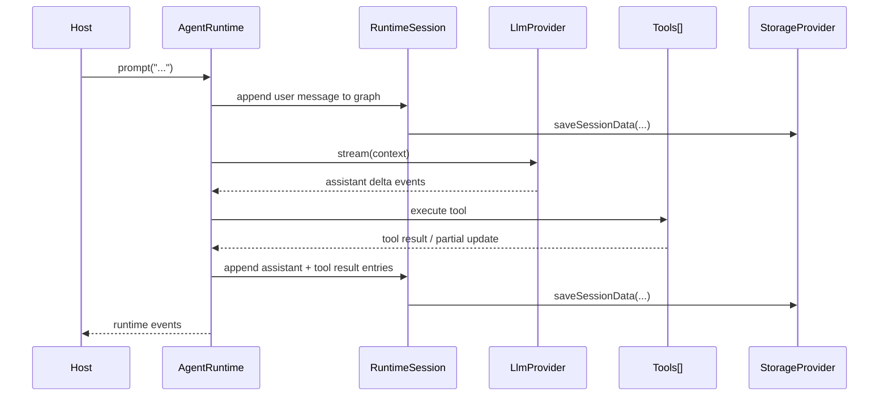
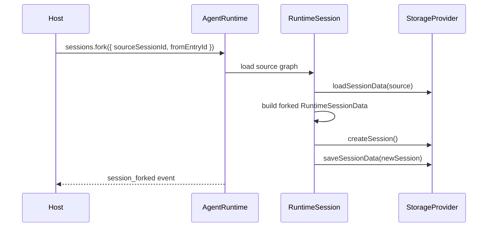

# 浏览器 Agent SDK V1 - 设计

> **状态**: 草稿
> **需求文档**: [requirements.md](./requirements.md)
> **最近更新**: 2026-04-09

## 概述

本设计的核心思路是：

- 让 runtime 内部保留一套强类型 session graph 和 agent 行为模型
- 让 storage provider 只负责 session metadata 和 opaque session document 的读写
- 让 LLM provider 统一输出标准化的 assistant stream event
- 让 tools 列表只描述工具定义与执行，不绑 UI、不绑 Office、不绑具体 transport

在行为未明确的地方，对齐 pi 的语义，尤其是：

- `packages/agent` 中的 agent loop、tool hook、steering/follow-up
- `packages/coding-agent` 中的 session graph、fork、compaction、context rebuild

## 架构概览

```mermaid
graph TD
    Host[宿主应用 / 浏览器页面] --> Runtime[AgentRuntime]

    Runtime --> SessionLayer[RuntimeSession]
    Runtime --> Loop[AgentLoopEngine]

    SessionLayer --> Codec[SessionDataCodec]
    SessionLayer --> Storage[StorageProvider]

    Loop --> LLM[LlmProvider]
    Loop --> Tools[ToolDefinitions[]]

    SessionLayer --> Prompt[PromptComposer 可选]

    Storage --> Stored[(SessionRecord + SessionData Blob)]
```

## 组件设计

### AgentRuntime

**目的**: 对外暴露 SDK 的统一对象 API。

**职责**:

- 暴露 `prompt()`、`continue()`、`steer()`、`followUp()`、`compact()`
- 管理对外可见的 `RuntimeState`
- 维护事件订阅与分发
- 协调 RuntimeSession 和 AgentLoopEngine

**依赖**:

- `RuntimeSession`
- `AgentLoopEngine`
- `LlmProvider`
- `ToolDefinition[]`

**接口**:

```ts
interface AgentRuntime<THostContext = unknown> {
  readonly state: RuntimeState;
  subscribe(listener: (event: RuntimeEvent) => void): () => void;
  prompt(input: PromptInput): Promise<void>;
  continue(): Promise<void>;
  steer(input: PromptInput): Promise<void>;
  followUp(input: PromptInput): Promise<void>;
  compact(options?: CompactionOptions): Promise<CompactionResult>;
}
```

### RuntimeSession

**目的**: 管理 session 生命周期与持久化重建。

**职责**:

- 支持 session 的创建、打开、更新、删除和 fork
- 将 runtime 内部 graph 通过 codec 序列化到 storage
- 从 storage 加载 opaque document 并还原 `RuntimeSessionData`
- 维护当前 session record、revision 和 head entry
- 为 compaction 和 fork 提供 graph 级操作能力

**依赖**:

- `StorageProvider`
- `SessionDataCodec`
- `PromptComposer` 可选

**接口**:

```ts
interface RuntimeSession<TSessionData = RuntimeSessionData> {
  open(sessionId: string): Promise<SessionRecord>;
  create(input?: CreateSessionInput): Promise<SessionRecord>;
  fork(input: ForkSessionInput): Promise<ForkSessionResult>;
  save(data: RuntimeSessionData, expectedRevision?: string): Promise<CommitResult>;
}
```

### AgentLoopEngine

**目的**: 实现对齐 pi 语义的 agent loop。

**职责**:

- 执行 assistant 流式响应
- 处理 tool call 和 tool result
- 维护 steering 和 follow-up 队列语义
- 调用 `beforeToolCall` 和 `afterToolCall`
- 保证 `continue()` 的合法性与 turn 边界一致性

**依赖**:

- `LlmProvider`
- `ToolDefinition[]`
- `ConvertToLlm`
- `TransformContext`

**接口**:

```ts
interface AgentLoopEngine {
  run(input?: PromptInput): Promise<void>;
  abort(): void;
}
```

### SessionDataCodec

**目的**: 隔离 runtime 内部 graph 与 storage payload 之间的转换。

**职责**:

- 将 `RuntimeSessionData` 编码成 storage 可保存的数据结构
- 将 storage payload 解码成 `RuntimeSessionData`
- 允许未来替换为压缩 JSON、自定义 schema 或远端格式

**接口**:

```ts
interface SessionDataCodec<TSessionData = unknown> {
  serialize(data: RuntimeSessionData): Promise<TSessionData> | TSessionData;
  deserialize(data: TSessionData): Promise<RuntimeSessionData> | RuntimeSessionData;
}
```

### Provider Adapters

**目的**: 把宿主能力接入统一运行时边界。

**职责**:

- `LlmProvider` 负责 assistant stream normalization
- `StorageProvider` 负责 session metadata + opaque document 读写
- `tools[]` 负责提供工具定义与执行逻辑

## API 设计

本特性不是 HTTP API 设计，而是 SDK API 设计。

### Runtime Factory

```ts
async function createAgentRuntime<THostContext = unknown, TSessionData = RuntimeSessionData>(
  options: AgentRuntimeOptions<THostContext, TSessionData>,
): Promise<AgentRuntime<THostContext>>;
```

**输入**:

- `model`
- `llmProvider`
- `storage`
- `tools`
- `sessionDataCodec` 可选
- `promptComposer` 可选
- `beforeToolCall` / `afterToolCall` 可选

**输出**:

- `AgentRuntime`

### Session API

```ts
runtime.sessions.create(input?)
runtime.sessions.open(sessionId)
runtime.sessions.list()
runtime.sessions.update(sessionId, patch)
runtime.sessions.delete(sessionId)
runtime.sessions.fork(input)
```

### Prompting API

```ts
runtime.prompt(input)
runtime.continue()
runtime.steer(input)
runtime.followUp(input)
runtime.compact(options?)
runtime.abort()
```

## 数据模型

### 实体关系图



### SessionRecord 结构

| 字段      | 类型       | 约束         | 说明             |
| --------- | ---------- | ------------ | ---------------- |
| id        | string     | PK, NOT NULL | session 唯一标识 |
| title     | string     | NULLABLE     | session 展示名称 |
| revision  | string     | NOT NULL     | 当前持久化版本号 |
| createdAt | ISO string | NOT NULL     | 创建时间         |
| updatedAt | ISO string | NOT NULL     | 最近更新时间     |
| metadata  | object     | NULLABLE     | session 元数据   |

### RuntimeSessionData 结构

| 字段        | 类型           | 约束     | 说明                             |
| ----------- | -------------- | -------- | -------------------------------- |
| version     | number         | NOT NULL | runtime session data schema 版本 |
| headEntryId | string\|null   | NOT NULL | 当前分支 head entry              |
| entries     | SessionEntry[] | NOT NULL | runtime 内部 graph               |
| metadata    | object         | NULLABLE | 仅 runtime 自用的数据            |

## 状态机



## 时序图

### 带工具调用的 Prompt 流程



### Session Fork 流程



## 错误处理

| 错误码               | 作用域  | 说明                              | 处理方式                                          |
| -------------------- | ------- | --------------------------------- | ------------------------------------------------- |
| ERR_STORAGE_CONFLICT | Storage | revision 冲突导致写入被拒绝       | 由 runtime 向上抛出或走重试/刷新策略              |
| ERR_SESSION_CODEC    | Session | session data 编解码失败           | 停止当前打开流程，避免覆盖已有数据                |
| ERR_LLM_STREAM       | LLM     | provider 返回无效终止事件或流中断 | 将 runtime 从 streaming 状态恢复为 error 或 ready |
| ERR_TOOL_ABORTED     | Tool    | tool 被 abort 或宿主拒绝执行      | 作为错误 tool result 处理                         |
| ERR_INVALID_CONTINUE | Runtime | 非法 continue 调用                | 直接拒绝并保留现有状态                            |

### 错误对象结构

```ts
type RuntimeError = {
  code: string;
  message: string;
  details?: Record<string, unknown>;
};
```

## 安全考虑

### 认证

- 浏览器 runtime 不直接持有上游模型厂商 API key
- 模型访问由后端代理实现，并在 `LlmProvider` 中归一化

### 授权

- v1 不内建用户确认弹窗
- 但保留 `beforeToolCall` / `afterToolCall` 以支持未来权限与审计机制

### 数据保护

- 默认不把 provider secrets 写入 session data
- 不把敏感配置直接通过 runtime events 向外广播

## 性能考虑

### 缓存策略

- v1 不要求内建复杂缓存层
- runtime 可以缓存当前 session graph 与已解析工具集

### 优化手段

- 将 storage 边界收敛为单个 opaque session document，减少 provider 复杂度
- 将 context rebuild 放在 runtime 内部，避免 storage 做图结构逻辑

### 扩展性

- v1 按单 session、单活跃写入方优化
- 通过 revision 为未来并发扩展预留能力

## 迁移计划

### 迁移前

- [ ] 冻结当前对外导出与现有测试基线
- [ ] 以 `docs/browser-agent-sdk-interface-draft.md` 为迁移目标接口

### 迁移步骤

1. 新增浏览器 Agent SDK 的核心类型与 provider 契约
2. 先补测试，锁定 runtime、storage、tool、compaction、fork 的目标行为
3. 引入 runtime 内部 session graph 与 `SessionDataCodec`
4. 用新的 storage 边界替换当前 `loadMessages/saveMessages` 语义
5. 引入新的 agent loop 与统一 LLM provider 语义
6. 实现 fork、compaction、steering、follow-up
7. 收敛导出入口并保留必要的过渡适配层

### 回退方案

1. 保持旧导出路径在迁移期间可回退
2. 迁移切片必须在测试通过前不删除旧能力

### 迁移后验证

- [ ] 所有 TDD 新增测试通过
- [ ] 现有兼容测试通过或被替换为等价新测试
- [ ] session create/open/fork/compact 行为符合规格

## 测试策略

### 单元测试

- `SessionDataCodec` 编解码
- storage provider contract
- LLM stream normalization
- tool hook 与工具执行结果归一化

### 集成测试

- prompt -> assistant streaming -> tool call -> persistence
- 打开 session -> 重建 context -> continue
- fork session -> new revision chain -> reopen
- compact -> persist compaction entry -> rebuild active context

### 端到端测试

- 以 test doubles 驱动的浏览器 runtime happy path
- 以 pi 语义为基线的 steering/follow-up 顺序验证

### TDD 执行规则

- 每个实现切片必须先写失败测试，再写最小实现通过测试，最后重构
- 若某处行为不确定，先参考 pi coding-agent 后写测试，而不是先写实现

## 待确认设计问题

- [ ] 自动 compaction 的阈值策略是否在 v1 首版交付，还是先只交付手动 `compact()` API？
- [ ] 是否为当前 `ai` SDK 风格接口保留一层兼容 adapter，以降低迁移成本？

## 参考资料

- [requirements.md](./requirements.md)
- [proposal.md](./proposal.md)
- [浏览器 Agent SDK 接口草案](../../../docs/browser-agent-sdk-interface-draft.md)
- `pi-mono/packages/agent`
- `pi-mono/packages/coding-agent`
